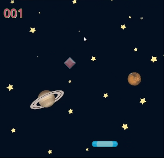

## Udemy Course: "Jumpstart to 2D Game Development: Godot 4.4+ for Beginners"

Instructor: Richard Allbert

https://www.udemy.com/course/jumpstart-to-2d-game-development-godot-4-for-beginners

## Summary

Et begynderkursus i Godot, som er en simpel, open source game engine.

## Table of Contents

[TOC]

### Section 1: Course Introduction

Han introducerer kurset, og forsikrer om, at man godt kan køre kurset på Godot 4.4, selv om det er optaget på basis af Godot 4.3

### Section 2: Preflight

Han fortæller, hvordan man kan downloade assets til brug i kurset, fra selve Udemy kursets side, og fortæller også noget om, hvor man ellers kan downloade ressourcer. Han nævner bl.a. følgende:

* https://www.kenney.nl - et berømt site med mange assets af høj kvalitet
* https://opengameart.org - har f.eks. en god samling af lydeffekter
* https://ansimuz.itch.io/sunny-land-pixel-game-art - har bl.a. en god "tile pack"
* https://pixelfrog-assets.itch.io/pixel-adventure-1 - har også bl.a. et godt "tile set"
* https://opengameart.org/content/parallax-2d-backgrounds - har flotte baggrunde til spil

Bemærk, at han har skrevet disse links i tekstfilen vist nedenfor, som kan downloades fra kurset :

```
https://opengameart.org/content/parallax-2d-backgrounds
https://craftpix.net/freebies/free-cartoon-parallax-2d-backgrounds/?utm_campaign=Website&utm_source=opengameart.org&utm_medium=public
https://opengameart.org/content/512-sound-effects-8-bit-style
https://www.kenney.nl/
https://ansimuz.itch.io/sunny-land-pixel-game-art
https://pixelfrog-assets.itch.io/pixel-adventure-1
https://opengameart.org/content/shmup-ships
```

Han runder sektionen af ved at snakke lidt om, hvordan man kan få hjælp. Det kan man f.eks. ved at zippe et projekt og sende til ham. I praksis kan man åbne sit projekt i Godot-miljøet, højreklikke på `res://` i Filesystem-viewet i nederste venstre del af GUI'en, og vælge "Open in File manager". Det åbner en folder i Windows Explorer, som bl.a. indeholder en "assets" folder, en ".godot" folder og en "project.godot" fil. Så zipper man hele folderens indhold og sender til ham.

### Section 3: Godot 4.4 - Gem Catcher

Han introducerer spillet Gem Catcher vist nedenfor, som man bygger i denne sektion



#### Godot setup

Først demonstrerer han, hvordan man installerer Godot. Man åbner en browser og navigerer hen til https://godotengine.org/ og downloader "Godot Engine" (*ikke* "Godot Engine - .NET"). Bemærk, at man bare bl.a. downloader den eksekverbar fil "Godot_v4.4-rc1_win64.exe", som man kan lægge, hvor man vil og bare eksekvere for at starte IDE'en op. I IDE'en er der et Asset library, hvor man kan downloade en masse eksempelprojekter. Der er også en Settings-knap, hvor man kan vælge mellem et antal naming styles, hvor han i øvrigt selv foretrækker Pascal.

Han gør opmærksom på, at man, når man laver et nyt projekt, bør vælge "Mobile", som renderer. Sjovt nok vælger han at unchecke Git, så han ikke får en gitignore fil. Jeg lod den være checked og fik filen vist nedenfor:

```
# Godot 4+ specific ignores
.godot/
/android/
```

Bemærk, at det ikke er meningen at man skal submitte .godot-folderen

Han demonstrerer, hvordan man laver et nyt projekt

#### Running a project

Han demonstrerer, hvordan man opretter en scene og tilføjer et icon til den ved at dragge icon-svg-filen fra FileSystem-viewet ind på viewporten, der vises som et rektangel i den centrale del af IDE'ens gui.

#### The Godot IDE

Han demonstrerer, hvordan man bruger tools fra toolbaren til f.eks. at panne, zoome, selecte og repositionere icons.
